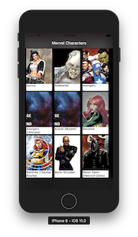

# react-native-marvel-characters
React Nativeを勉強するために作成したアプリです。  
Marvel APIを使用しています。

# 前準備
準備するものは2つです。

## Marvel APIのPublic KeyとPrivate Key
Marvel Developer siteにいってユーザー登録をしてください。  
登録が完了すると[My Developer Account]というリンクから **Your public key** と **Your private key** が確認できます。 
ルートディレクトリに .env というファイルを作成し、そこにAPIのURLと上記のキーを登録してください。
```.env
MARVEL_URL=http://gateway.marvel.com/v1/public
MARVEL_PUBLIC_API_KEY=YOUR＿PUBLIC＿API
MARVEL_PRIVATE_API_KEY=YOUR＿PRIVATE＿API
```

## BackCoverの用意
ルートディレクトリに images というディレクトリを作成してください。  
自分の好きな画像を取得し、作成したimagesの中に **backcover.png** というファイル名で保存してください。

# 使い方
以下を行う前にReactNativeの[Getting Started](https://facebook.github.io/react-native/docs/getting-started.html)の`Building Projects with Native Code`でiOSとAndroidのエミュレータ動作をしておくとスムースに進められると思います。

依存パッケージをinstallします。
```command
yarn
```

react-nativeクライアントを起動します。
```command
yarn start
```

起動が完了したら、別のターミナルで以下のいずれかを実行します。
```command
// iOS（Xcodeがインストールされている必要があります）
react-native run-ios

// android（事前にAndroid StudioでVirtual Deviceを起動させてください。
react-native run-android
```

# スクリーンショット
  