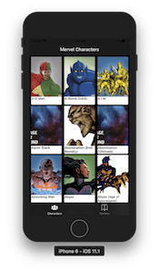
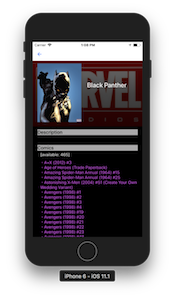
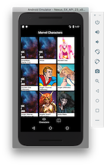
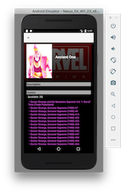

# react-native-marvel-characters
React Nativeを勉強するために作成したアプリです。  
Marvel APIを使用しています。

# Preparation
本アプリを使用するための前準備です。

## 1. Getting Started with Marvel API
`DEVELOPER PORTAL`(developer.marvel.com)でユーザー登録をしてください。  
登録が完了すると[My Developer Account]というリンクから **Your public key** と **Your private key** が確認できます。  
ルートディレクトリに `.env` というファイルを作成し、APIのEndpoint、`Public key`, `private key`の３つを書いてください。
```.env
MARVEL_URL=http://gateway.marvel.com
MARVEL_PUBLIC_API_KEY=[YOUR＿PUBLIC＿API]
MARVEL_PRIVATE_API_KEY=[YOUR＿PRIVATE＿API]
```

## 2. backcover.pngの用意
`images`ディレクトリに**backcover.png**という画像ファイルを用意してください。  
この画像ファイルはCharacterとComicの詳細画面にて、サムネイルエリアの背景になります。  

## 3. Install dependencies package
依存パッケージをinstallしてください。
```command
yarn
```

# Usage
ReactNativeの[Getting Started](https://facebook.github.io/react-native/docs/getting-started.html)の`Building Projects with Native Code`でiOSとAndroidのエミュレータ動作をしておくとスムースに進められると思います。

1. react-nativeクライアント起動
```command
yarn start
```

2. 別のターミナルでiOSエミュレータまたはAndroidエミュレータを実行します。
```command
// iOS（Xcodeがインストールされている必要があります）
react-native run-ios

// android（事前にAndroid StudioでVirtual Deviceを起動させてください。
react-native run-android
```

# Screenshots
## iOS

  

## Android

  
