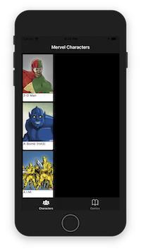
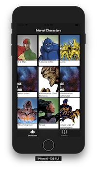

# Tips
このアプリを作成する際に勉強したことをまとめます。

# 最初にやったこと
アプリを作り始める前に、FaceBookのReactNative公式ページにある[チュートリアル The Basics](https://facebook.github.io/react-native/docs/getting-started.html)を一通り学習しました。
最初の環境構築にかなり時間を費やしましたが、あとはすんなり進められました。
ReactNativeはES6の構文が使えるため、`Guides`チャプターの`JavaScript Environment`でbabelの公式サイトと合わせてES6の構文を確認しました。
また、どういったComponentがあるのか確認するため、`Components`チャプターに書かれたライブラリ群を簡単に流し読みしました。
`Guides`チャプターや`Components`チャプターは基本的にアプリ作成を進める中で不明点を調査するため読むことが多かったです。

## 環境構築で引っかかったこと
`The Basics`の`Getting-started`ではReactNativeの始め方を２通り紹介しています。
  1. Quick Start
  2. Building Projects with Native Code

1→2の順で実施しましたが、始める前にまず`node.js`がインストールされていることが前提になります。  
この時、`nodebrew`を入れてnodeのバージョンを切り替えられるようにしたほうが良いです。
私は最新の`npm5`を入れたら「そのバージョンではReactNative対応してません。npm4でお願いします。」とインストール途中でエラーになりました。  
また、ReactNativeは大きなプロジェクトですので解決されているかはともかくくだらないエラーメッセージでもissueに挙げられています。
そのため、引っかかったらまずはissueを検索するようにしました。Googleで検索しても先頭の方にissueが引っかかることが多かったです。

## Quick Startについて
`create-react-native-app`コマンドでReactNativeプロジェクトを作成する方法です。  
こちらの方法ではExpoというソフトウェアを使用できるため、GUIでの操作や実機へのアプリインストールがQRコードで簡単にできます。  
反面、ビルド時にネイティブコードを出力しないため、ネイティブコードをいじるようなアプリには向きません。  
現状、サードパーティ製のライブラリを使用するときはまだネイティブコードをいじる必要がある場合が多いと感じました。  
今回であればvectorIconやConfigを使用する際にネイティブコードに手を加えています。  

## Building Projects with Native Codeについて
こちらは従来通り`react-native`コマンドでプロジェクトを作成する方法です。  
`Quick Start`の最後の方でも説明がありますが、ネイティブコードを出力するためビルド後にAndroidStuidoやXcodeを使用してアプリをいじることができます。  
ネイティブコードというのはそのままで、ビルドするとルートディレクトリに`android`と`ios`というディレクトリが生成されます。  
`android`ディレクトリにはgradleプロジェクトが出力されるためbuild.gradleを書き換えたり中身のJavaを触ることができます。  
`ios`ディレクトリにはxcodeプロジェクトが出力されるため、Info.plistなど触ることができます。  
まああまりやらないほうがいいのでしょうが、上記でも説明した通りまだサードパーティ製ライブラリを使用する時はネイティブコード多いため本アプリはこっちの方法でプロジェクトを作成しています。  
よくネット上で検索に引っかかる`index.ios.js`や`index.android.js`はこっちのプロジェクト作成方法でないと多分使えません。

## アプリ作成にあたって
ReactNativeで作成されたSampleアプリが[Github](https://github.com/ReactNativeNews/React-Native-Apps)で多く公開されています。  
最終コミット日が2年前など古いものもありますが、ここにあるアプリのREADMEを眺めて良さそうなのをいくつか読みました。  
特に作成しようとしていたアプリはReduxを使う予定だったのでReduxを使っているアプリをピックアップしました。  

# 良く分からなかったことや学習の補足事項
アプリ作成を進める中で調査したことをまとめます。
色々あったので以下の分類にまとめます。
 1. アプリに関すること
 2. ReactやReduxに関すること

# アプリに関すること
アプリを作成する上での実現手段や使用したOSSライブラリについて書いています。

## 画面遷移の方法
公式の[Navigating Between Screens](https://facebook.github.io/react-native/docs/navigation.html)を参考にしました。  
いくつか方法があるようですが、今回はAndroidとiOS両方でほぼ同じコードが使えることと、参考にしたSampleアプリで良さそうなのが`react-native-navigation`を使っていたことから、`react-native-navigation`を使用することにしました。  
このライブラリはドキュメントがしっかりしているので[使い方](https://wix.github.io/react-native-navigation/#/usage)もほぼドキュメントだけで事足りました。  
今回のアプリでNavigationを使用した動作は画面下部のメニューアイコン２つと詳細画面の「戻る」アイコンの計３つです。  
詳細画面では、`constructor`で`setOnNavigatorEvent`をし、イベントハンドラを受け取る関数`_onNavigatorEvent`をbindしています。  
`_onNavigatorEvent`の中で、アイコンタップイベントを受け取り、`type`や`id`で処理を判定します。`type`と`id`は公式ドキュメントを参考にしました。  
画面下部のメニューアイコンについて、キャラ一覧の方はアプリ起動時の初期表示画面なので起動したらそのままActionを実行し結果を表示しています。  
それ以外のメニューであるComicsはタップした時にデータを取得したいので、詳細画面と同様にNavigationのリスナーを登録してタップ時にActionを実行するようにしています。  

## 画像アイテムを横に並べて画面の端で折り返す方法
公式の`The Basics`チャプターにある`Layout with Flexbox`では縦横にアイテムを並べる方法はありますが、私が今回実現したかったFlexboxのように左で折り返してアイテムを表示させ、かつスクロール可能な方法はありません。  
調査の結果、サードパーティ製のライブラリを使う方法や`FlatList`で実現する方法もありましたが、`ListView`のstyleを`contentContainerStyle`にすることでも実現可能なことがわかりました。  
どういうことか、それぞれスクリーンショットと該当箇所のコードを載せます。

### ただのstyleで定義した場合のスクリーンショット
  

```javascript
// characters.jsのrender関数
render() {
    return (
        <ListView 
            style={styles.listView}
            // ・・・
```
  
一方、`contentContainerStyle`を使用した場合、以下のようになります。

### contentContainerStyleで定義した場合のスクリーンショット
  

```javascript
// characters.jsのrender関数
render() {
    return (
        <ListView 
            contentContainerStyle={styles.listView}
```

今回作成したアプリは縦横幅が全く同一の画像アイテムをGrid形式で並べたかっただけでしたので、この機能だけで事足りました。

## リストの下まで行ったら次を読み込む方法
よくあるSPAのような、例えば  
「商品リストを一番下までスクロールしたら次の20件の商品アイテムをAPI経由で取得してリストに表示する」  
ということを実現したかったのですが標準Componentだけではできそうもなかったため調べました。  
その結果、`react-native-infinite-scroll-view`というOSSライブラリを使うことにしました。  
これを利用すると・・ *TODO*

## APIなど設定値どうするか？
*TODO* react-native-configの話

# ReactやReduxに関すること
アプリを作成している中で、設計や実装をどうしていいか迷った事項について書いています。

## HTTP通信と叩くレイヤー
APIを叩くのは`Reducer`、`Action`、`View`のどこが適切なのか不明でした。  
`Reducer`は`Store`から送られた`Action`を元に発火し、`state`をどのように変化させるか指定する役割を担います。  
`Reducer`では明確にAPIを叩いたりDateのnowなど実行結果に冪等性がないものを扱ってはならない、とされています。  
また、`Action`も`Reducer`で対応するアクションを実行するためのただの情報の塊であり、**Type**と**その値(省略可)**を持ちます。  
この`Action`は`ActionCreator`によって生成されますが、[reduxのActions.md](https://github.com/reactjs/redux/blob/master/docs/basics/Actions.md)を読む限り、`ActionCreator`は副作用があっても良いとされていることが分かりました。  
そのため、作成したアプリではペイロードとしての`Action`を定義し、`ActionCreator`の中でAPIを叩いています。

## PropTypesとFlowについて
*TODO* PropTypesとFLowTypesについて

## stateとsetStateについて
いくつかのSampleアプリでは`this.state.XXX = YYY`とstateに直接値を代入していました。  
しかし、`setState`でもstateを変化させることができるため、じゃあこの違いはなに？という疑問が湧いたため調査しました。  
結論として以下のような理解になりました。
1. `this.state`への直接代入は変更を直ちに反映させるが、破壊的変更でありやってはならない。`this.state`は参照にだけ使用する。
2. `setState`は`state`の変化を依頼するもので、`render()`など特定のタイミングで反映される。`Component`の`state`を変化させる場合は`setState`でのみ行う。

これは[React.jsのstateの章](https://reactjs.org/docs/react-component.html)(一番下の部分)で記載されていたものを参考にしました。  
また、このリンク先のstateの章にもありますが、`setState`は反映されるタイミングがあるためComponentのライフサイクルを理解しないと結構ハマります。  
